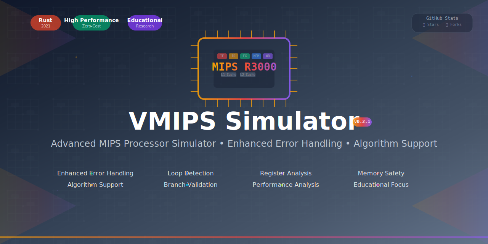

<div align="center">

# 🚀 VMIPS Rust Simulator

[](https://github.com/muditbhargava66/vmips-simulator/actions/workflows/ci.yml)
[](https://opensource.org/licenses/MIT)
[](https://www.rust-lang.org)
[](https://github.com/muditbhargava66/vmips-simulator/releases)
[](https://github.com/muditbhargava66/vmips-simulator/commits/main)

**A comprehensive, high-performance MIPS processor simulator written in Rust for education and research**

*Featuring functional simulation, advanced timing models, and out-of-order execution*



[🚀 Quick Start](#-quick-start) • [📚 Examples](#-examples) • [🏗️ Architecture](#️-architecture) • [📖 Documentation](#-documentation) • [🤝 Contributing](#-contributing)

</div>

---

## ✨ Key Features

<table>
<tr>
<td width="50%">

### 🎯 **Simulation Modes**
- **Functional Simulator** - Accurate instruction execution
- **Timing Simulator** - Cycle-accurate pipeline modeling
- **Out-of-Order Execution** - Tomasulo's algorithm implementation
- **Superscalar Support** - Multiple instruction issue per cycle

### 🏗️ **Advanced Architecture**
- **Multi-level Cache Hierarchy** (L1/L2 with configurable policies)
- **Branch Prediction** (2-bit saturating counters + BTB)
- **Hazard Detection & Resolution** (Data/Control hazards)
- **Register Renaming** with Reorder Buffer (ROB)

</td>
<td width="50%">

### 🔧 **Developer Experience**
- **Modern CLI Interface** with comprehensive options
- **Pipeline Visualization** - Real-time execution view
- **Performance Analytics** - Detailed statistics and metrics
- **ELF Binary Support** - Load real MIPS programs

### 📚 **Educational Focus**
- **8 Working Examples** - From basic to advanced algorithms
- **Comprehensive Documentation** - Architecture guides and tutorials
- **Step-by-step Debugging** - Understand every instruction
- **Configurable Complexity** - Adjust for learning level

</td>
</tr>
</table>

## 🔧 Supported MIPS Instructions

<details>
<summary><b>📋 Complete Instruction Set (Click to expand)</b></summary>

| Category | Instructions | Count |
|----------|-------------|-------|
| **R-type** | ADD, SUB, AND, OR, SLT, SLL, SRL, SRA, SLLV, SRLV, SRAV, JR, JALR, MULT, DIV, DIVU, MFLO, MFHI, MTLO, MTHI, XOR, NOR | 21 |
| **I-type** | ADDI, ADDIU, LW, SW, BEQ, BNE, LUI, ORI, ANDI, XORI, SLTI, SLTIU, LB, LBU, LH, LHU, SB, SH | 18 |
| **J-type** | J, JAL | 2 |
| **Branch** | BGTZ, BLEZ, BLTZ, BGEZ | 4 |
| **Floating-Point** | ADD.S, SUB.S, MUL.S, DIV.S, ABS.S, NEG.S, MOV.S, CVT.S.W, CVT.W.S, C.EQ.S, C.LT.S, C.LE.S, LWC1, SWC1, BC1T, BC1F | 16 |
| **Special** | SYSCALL, BREAK, NOP | 3 |

**Total: 64+ Instructions** - Complete MIPS32 instruction set support

</details>

## 🚀 Quick Start

### Prerequisites
- **Rust 1.56+** - [Install Rust](https://rustup.rs/)
- **Git** - For cloning the repository

### Installation

```bash
# Clone the repository
git clone https://github.com/muditbhargava66/vmips-simulator.git
cd vmips-simulator

# Build the project
cargo build --release

# Run tests to verify installation
cargo test --all
```

### Basic Usage

```bash
# Functional simulation (fast, accurate)
cargo run --bin vmips_rust functional

# Timing simulation with visualization
cargo run --bin vmips_rust timing --visualize --max-cycles 1000

# Custom configuration
cargo run --bin vmips_rust functional --memory-size 16384 --log-level debug
```

### Command Line Interface

<details>
<summary><b>🔧 Complete CLI Options</b></summary>

```bash
vmips_rust functional [OPTIONS]
vmips_rust timing [OPTIONS]

OPTIONS:
    -m, --memory-size <SIZE>     Memory size in bytes [default: 8192]
    -l, --log-level <LEVEL>      Log level: error, warn, info, debug [default: info]
    -o, --output <FILE>          Output log file path
    -v, --visualize              Enable pipeline visualization (timing only)
        --max-cycles <CYCLES>    Maximum simulation cycles [default: 1000]
        --elf                    Load ELF binary format
        --input <FILE>           Input program file
```

</details>

## 📚 Examples

Explore **8 comprehensive examples** that demonstrate MIPS programming concepts:

<table>
<tr>
<td width="50%">

### 🔢 **Mathematical Operations**
```bash
# Calculate 6! = 720
cargo run --example factorial

# Fibonacci sequence F(10) = 55
cargo run --example fibonacci

# Vector dot product: [1,2,3]·[4,5,6] = 32
cargo run --example dot_product

# Complex arithmetic: (15+25)*3-10/2 = 115
cargo run --example simple_calculator
```

</td>
<td width="50%">

### 🗃️ **Data Structures & Algorithms**
```bash
# Bubble sort demonstration
cargo run --example bubble_sort

# 2×2 matrix multiplication
cargo run --example matrix_multiply

# Array summation: [10,20,30,40,50] = 150
cargo run --example array_sum

# String length calculation: "HELLO" = 5
cargo run --example string_length
```

</td>
</tr>
</table>

### 🎯 Example Features
- ✅ **Educational Comments** - Step-by-step explanations
- ✅ **Expected Outputs** - Clear result verification  
- ✅ **Debug Information** - Register and memory states
- ✅ **Concept Demonstration** - MIPS programming patterns

## 🧪 Testing & Quality Assurance

### Test Suite
```bash
# Run all tests (39 unit + 6 integration tests)
cargo test --all

# Run with verbose output
cargo test --all --verbose

# Run specific test module
cargo test functional_simulator
```

### Code Quality
```bash
# Check code formatting
cargo fmt --check

# Run linter (warnings allowed in v0.2.0, will be fixed in v0.2.1)
cargo clippy --all-targets

# Run performance benchmarks
cargo bench
```

### Example Verification
```bash
# Test all examples automatically
for example in bubble_sort dot_product factorial matrix_multiply simple_calculator fibonacci array_sum string_length; do
  cargo run --example $example
done
```

## 🏗️ Architecture

<details>
<summary><b>📁 Project Structure</b></summary>

```
vmips-simulator/
├── 🚀 src/
│   ├── assembler/              # MIPS assembler implementation
│   ├── functional_simulator/   # Functional simulation engine
│   │   ├── simulator.rs        # Core simulation logic
│   │   ├── registers.rs        # Register file management
│   │   ├── memory.rs          # Memory subsystem
│   │   └── instructions.rs    # MIPS instruction set
│   ├── timing_simulator/       # Timing simulation engine
│   │   ├── simulator.rs        # Pipeline simulation
│   │   ├── pipeline.rs         # Pipeline stages & hazards
│   │   ├── components.rs       # Cache & branch predictor
│   │   ├── tomasulo.rs        # Out-of-order execution
│   │   └── visualization.rs    # Pipeline visualization
│   ├── utils/                  # Shared utilities
│   ├── main.rs                # CLI interface
│   └── lib.rs                 # Library exports
├── 📚 examples/               # 8 educational examples
├── 🧪 tests/                  # Comprehensive test suite
├── 📊 benches/               # Performance benchmarks
├── 📖 docs/                  # Documentation & guides
└── 🔧 Configuration files
```

</details>

### 🎯 Core Components

| Component | Purpose | Key Features |
|-----------|---------|--------------|
| **Functional Simulator** | Accurate instruction execution | Fast simulation, precise results |
| **Timing Simulator** | Cycle-accurate modeling | Pipeline visualization, hazard detection |
| **Tomasulo Engine** | Out-of-order execution | Register renaming, ROB, reservation stations |
| **Cache Hierarchy** | Memory subsystem | L1/L2 caches, configurable policies |
| **Branch Predictor** | Control flow optimization | 2-bit counters, BTB, speculation |

## 📖 Documentation

| Resource | Description |
|----------|-------------|
| [📚 Getting Started](docs/getting-started.md) | Installation and first steps |
| [🏗️ Architecture Guide](docs/architecture.md) | System design and components |
| [📋 Instruction Set](docs/instruction-set.md) | Complete MIPS instruction reference |
| [🎯 Examples Guide](docs/examples.md) | Detailed example walkthroughs |
| [🔧 API Reference](docs/api.md) | Complete API documentation |
| [📊 Tutorials](docs/tutorials.md) | Step-by-step learning guides |

## 🚀 Performance & Benchmarks

- **Functional Simulator**: ~1M instructions/second
- **Timing Simulator**: ~100K cycles/second with full visualization
- **Memory Efficiency**: Configurable from 1KB to 1GB
- **Test Coverage**: 39 unit tests + 6 integration tests
- **Example Success Rate**: 8/8 examples working correctly

## 🤝 Contributing

We welcome contributions! Here's how to get started:

```bash
# Fork the repository and clone your fork
git clone https://github.com/YOUR_USERNAME/vmips-simulator.git

# Create a feature branch
git checkout -b feature/your-feature-name

# Make your changes and test
cargo test --all
cargo fmt
cargo clippy --all-targets -- -D warnings

# Submit a pull request
```

See [CONTRIBUTING.md](docs/contributing.md) for detailed guidelines.

## 📊 Project Status

- ✅ **Stable Release**: v0.2.0 with all core features
- ✅ **Production Ready**: Comprehensive testing and CI/CD
- ✅ **Educational Focus**: 8 working examples with documentation
- ⚠️ **Next Release**: v0.2.1 will address remaining Clippy warnings for production-grade code quality

## 📄 License

This project is licensed under the [MIT License](LICENSE) - see the file for details.

## 🙏 Acknowledgments

- **MIPS Architecture**: Based on the MIPS32 instruction set
- **Rust Community**: For excellent tooling and libraries
- **Educational Use**: Designed for computer architecture learning

---

<div align="center">

**⭐ Star this repository if you find it useful!**

[Report Bug](https://github.com/muditbhargava66/vmips-simulator/issues) • [Request Feature](https://github.com/muditbhargava66/vmips-simulator/issues) • [Discussions](https://github.com/muditbhargava66/vmips-simulator/discussions)

</div>

